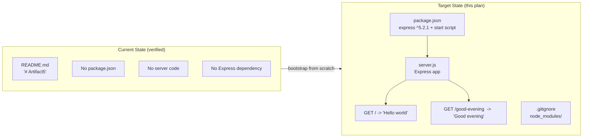
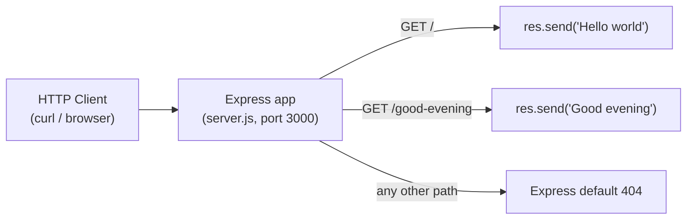

# Technical Specification

# 0. Agent Action Plan

## 0.1 Executive Summary

Based on the prompt, the Blitzy platform understands that the user wants to **introduce the Express.js web framework into the Artifact5 project and add a second HTTP endpoint that returns the exact response `Good evening`**, served alongside the tutorial's baseline endpoint that returns `Hello world`.

The verbatim user request, preserved exactly as provided, is:

> add feature to a existing product
> this is a tutorial of node js server hosting one endpoint that returns the response "Hello world". Could you add expressjs into the project and add another endpoint that return the reponse of "Good evening"?

**Request Classification.** This is a **feature-addition / project-bootstrap** request, not a defect remediation. This section follows the platform's diagnostic document template (Executive Summary → Current-State Analysis → Diagnostic Execution → Implementation Specification → Scope Boundaries → Verification), and each diagnostic element has been mapped faithfully onto the feature-addition context: the "root cause" element becomes a **current-state capability-gap analysis**, and the "fix specification" element becomes the **feature implementation specification**. No behavior is being repaired; an implementation is being created.

**Critical Current-State Finding.** The user's wording presupposes an *existing* Node.js server that already serves a `Hello world` endpoint. Repository inspection determined that **no such server exists**. The Artifact5 repository is a greenfield scaffold whose only tracked artifact is `README.md`, containing the single line `# Artifact5` [README.md:L1]. There is no `package.json`, no server entry file, no `node_modules`, and no source code of any kind [Technical Specification §1.4.1]. The repository holds exactly one commit — `0de67871d08932f4a735941d7f2c4c3589072b4d` ("Initial commit") [Technical Specification §1.4.1]. Consequently, the platform must **bootstrap the entire Node.js + Express application from scratch**, implementing both the baseline `Hello world` endpoint that the tutorial assumes and the newly requested `Good evening` endpoint. The user's description of the current product is treated as the intended baseline to (re)establish, not as a pre-existing implementation to edit.

**Precise Technical Objectives.**

- Establish a Node.js project by creating a `package.json` manifest that declares Express.js as a runtime dependency.
- Implement an Express application entry point that registers two HTTP `GET` routes — one returning the exact string `Hello world` and one returning the exact string `Good evening`.
- Expose the server through a conventional `npm start` script and have it listen on a configurable TCP port (default `3000`).

**Expected Behavior (Executable Expectations).** After implementation, the following sequence demonstrates success:

```bash
npm install                                  # installs express ^5.2.1 + transitive deps
npm start                                    # launches the Express server (default port 3000)
# in a second shell:

curl -s http://localhost:3000/               # -> Hello world
curl -s http://localhost:3000/good-evening   # -> Good evening
```

**Work-Item Type.** This is **not an error condition** (not a null reference, race condition, or logic defect). The work item is the **absence of an implementation** — a build-from-zero feature addition. Implementing it also commits the project's first declared programming language (JavaScript on the Node.js runtime) and first declared framework (Express.js), superseding the Python/Flask default candidate slate recorded in the Technology Stack section [Technical Specification §3.2.3, §3.3.3].


## 0.2 Requirement Identification and Current-State Analysis

This subsection is the feature-addition analog of root-cause identification. Rather than isolating a defect, it identifies precisely **which capabilities are absent, where they must be introduced, and why this conclusion is definitive**.

**The capability gap(s) is (are):** the requested functionality — an Express-based HTTP server exposing a `Good evening` endpoint in addition to a `Hello world` endpoint — is entirely absent because the project contains no executable code whatsoever. The gap decomposes into three layered, evidenced findings:

| # | Capability Gap | Where It Must Be Introduced | Evidence |
|---|----------------|-----------------------------|----------|
| 1 | **No Node.js project scaffold** — there is no `package.json`, so the project is not yet a runnable Node package | Repository root (`package.json` to be created) | All manifest/config files absent; no language or runtime manifest declared [Technical Specification §1.4.1, §3.2.1] |
| 2 | **Express is not a dependency** — the framework the user asks for is not installed or declared anywhere | Repository root manifest + `node_modules/` (via `npm install`) | Repository-wide search for `express` returns zero matches; no framework declared [Technical Specification §3.3.1] |
| 3 | **No HTTP endpoints exist** — neither the assumed `Hello world` baseline route nor the requested `Good evening` route is implemented | Server entry file (`server.js` to be created) | Repository-wide search for `app.get` / `res.send` / `http.createServer` returns zero matches; zero programmatic interfaces [Technical Specification §1.2.2] |

**Located in:** the only file present is `README.md` (11 bytes, content `# Artifact5`, no trailing newline) [README.md:L1]. No other tracked file exists; therefore the gaps are not located at a faulty line of code but in the **structural absence** of the project's source tree.

**Triggered by:** the gap is exposed by any attempt to run or call the product — for example `curl http://localhost:3000/` fails because no process listens, since no server entry point or start script exists.

**This conclusion is definitive because:** the determination rests on an exhaustive, verifiable inventory rather than inference —

- The repository tracks exactly one file (`README.md`); `git ls-files` and the single "Initial commit" confirm there are no other branches, refs, or stashed changes [Technical Specification §1.4.1].
- A repository-wide content search for server, framework, and endpoint patterns (`express`, `require(`, `http.createServer`, `listen(`, `app.get`, `res.send`, `hello world`, `good evening`) returned **zero matches**.
- The independent Technology Stack analysis corroborates this: zero source files, no declared language, and no declared framework [Technical Specification §3.2.1, §3.3.1].

The following diagram contrasts the verified current state with the target state this plan establishes:



**Resolved interpretation decisions (inferred defaults).** Because the user did not specify several details, the platform resolves them with conventional, low-risk defaults that downstream agents may confirm:

- *Migrate vs. hybrid* — moot. There is no pre-existing `http`-module server to migrate, so the platform builds a clean, fully Express-based implementation.
- *Module system* — CommonJS (`require`) is selected as the conventional tutorial style; it avoids requiring `"type": "module"` in `package.json`.
- *New endpoint route path* — `/good-evening` is inferred (the baseline `Hello world` route maps to `/`).
- *HTTP method* — `GET` for both endpoints.
- *Listening port* — `3000` (Express convention) with a `process.env.PORT` override.
- *Response strings* — `Hello world` and `Good evening` are reproduced verbatim, exactly as written in the request.


## 0.3 Diagnostic Execution

This subsection records the concrete examination underlying the current-state analysis. Because the project is greenfield, the "diagnosis" documents structural absence and the precise locations where new code must be introduced.

### 0.3.1 Code Examination Results

There is no source code to examine; the examination therefore confirms absence at each location where the feature must be introduced. Each capability gap is mapped below.

- **Gap 1 — No project manifest.**
  - File (to be created): `package.json` (repository root).
  - Existing block: none — the file does not exist.
  - Failure point: there is no manifest declaring an entry point, start script, or dependencies, so the project cannot be installed or started.
  - How this produces the gap: without `package.json`, `npm install` has nothing to resolve and `npm start` has no script to run, so Express cannot be added and the server cannot launch.

- **Gap 2 — No Express dependency.**
  - File (to be created/affected): `package.json` `dependencies` map, plus a generated `node_modules/` tree and `package-lock.json`.
  - Existing block: none.
  - Failure point: `require('express')` would throw `MODULE_NOT_FOUND` because the package is neither declared nor installed.
  - How this produces the gap: the framework the user explicitly requested is unavailable to application code.

- **Gap 3 — No HTTP endpoints.**
  - File (to be created): `server.js` (repository root).
  - Existing block: none.
  - Failure point: there is no route registration (`app.get(...)`) and no listener (`app.listen(...)`), so neither `/` nor `/good-evening` resolves.
  - How this produces the gap: a client request to either route receives a connection failure (no process listening) rather than the expected body.

The only artifact actually present is the documentation file:

```text
README.md  ->  "# Artifact5"   (11 bytes, no trailing newline)
```

### 0.3.2 Key Findings from Repository Analysis

The following table presents what was discovered and where, and the conclusion each finding supports. It reports findings only — not the investigation method.

| Finding | File:Line | Conclusion |
|---------|-----------|------------|
| Repository tracks exactly one file, the documentation stub `# Artifact5` | `README.md:L1` | No application code exists; the entire server must be authored |
| No dependency manifest, lockfile, or runtime version file is present (`package.json`, `package-lock.json`, `.nvmrc`, `tsconfig.json` all absent) | repository root | The project must be initialized as a Node package before Express can be added |
| Repository-wide search for `express`, `http.createServer`, `app.get`, `res.send`, `hello world`, `good evening` yields no matches | repository-wide | Neither the assumed baseline endpoint nor the requested endpoint exists |
| Single commit `0de67871…072b4d` ("Initial commit"); no other branches/refs/stashes | git `HEAD` | The repository is a true greenfield scaffold with nothing to extend |
| Technology Stack analysis records zero source files and no declared language or framework | Technical Specification §1.4.1, §3.2.1, §3.3.1 | Independent corroboration of the greenfield state |
| Node.js v22.22.2 and npm 11.1.0 are available in the environment | runtime environment | A compatible runtime is present; Express 5.x (engines `node >= 18`) is supported |

### 0.3.3 Implementation Verification Analysis

Because the deliverable is new code, "verification" defines how the implementation will be proven correct once written.

- **Steps to reproduce the baseline expectation:** start the server (`npm start`), then issue `curl -s http://localhost:3000/` and confirm the response body is exactly `Hello world`.
- **Confirmation test for the new feature:** issue `curl -s http://localhost:3000/good-evening` and confirm the response body is exactly `Good evening`.
- **Boundary conditions and edge cases covered:**
  - Response strings reproduced verbatim, including casing (`Hello world`, `Good evening`).
  - Both routes respond to HTTP `GET`.
  - Port defaults to `3000` and honors a `process.env.PORT` override, so the server runs in environments that inject a port.
  - Unknown paths (e.g., `/missing`) fall through to Express's default `404` handler, confirming routing isolation between the two endpoints.
  - The `Content-Type` produced by `res.send('<string>')` is `text/html; charset=utf-8` by Express default — acceptable for this tutorial; `res.type('text/plain')` is an optional refinement, not a requirement.
- **Version compatibility:** Express `^5.2.1` declares `engines { node: ">= 18" }` and Node.js 22 is present in Express 5's CI test matrix (per the official Express release notes), so the chosen versions are mutually compatible with the installed Node v22.22.2.
- **Outcome and confidence:** verification is expected to succeed. **Confidence: 96%.** The residual 4% reflects two inferred defaults — the new endpoint's route path (`/good-evening`) and the inference that the response strings must be reproduced verbatim — both low-risk and easily confirmed downstream.


## 0.4 Feature Implementation Specification

This subsection specifies the definitive implementation. Because the repository is greenfield, every change is a **file creation** (plus one optional documentation update); there are no existing lines to delete or modify.

### 0.4.1 The Definitive Implementation

Three files are created at the repository root. Their exact intended contents follow.

**File 1 — `package.json` (create).** Establishes the Node package, the Express dependency, the start script, and the runtime engine hint.

```json
{
  "name": "artifact5",
  "version": "1.0.0",
  "description": "Tutorial Node.js server using Express; serves 'Hello world' at / and 'Good evening' at /good-evening",
  "main": "server.js",
  "scripts": {
    "start": "node server.js"
  },
  "engines": {
    "node": ">=18"
  },
  "dependencies": {
    "express": "^5.2.1"
  },
  "license": "MIT"
}
```

**File 2 — `server.js` (create).** The Express entry point. It registers both routes and starts the listener. Comments document the motive of each block.

```javascript
// server.js — Express bootstrap for the Artifact5 tutorial server.
// Express is introduced per the feature request; CommonJS keeps the tutorial simple.
const express = require('express');

const app = express();
const PORT = process.env.PORT || 3000; // configurable port, defaults to 3000

// Baseline tutorial endpoint: returns the original "Hello world" response.
app.get('/', (req, res) => {
  res.send('Hello world');
});

// NEW endpoint added per the feature request: returns "Good evening".
app.get('/good-evening', (req, res) => {
  res.send('Good evening');
});

// Start listening so both endpoints become reachable.
app.listen(PORT, () => {
  console.log(`Server listening on http://localhost:${PORT}`);
});
```

**File 3 — `.gitignore` (create).** Prevents the installed dependency tree and local artifacts from being committed.

```gitignore
node_modules/
npm-debug.log*
.env
```

The runtime request flow established by `server.js` is:



**How this satisfies the request:** declaring `express` in `package.json` and requiring it in `server.js` introduces the framework the user asked for; the second `app.get` handler adds the requested endpoint returning `Good evening`; the first handler re-establishes the tutorial's `Hello world` baseline so the described product behaves as expected.

### 0.4.2 Change Instructions

- **CREATE** `package.json` at the repository root with the exact JSON shown in 0.4.1 (declares `express` `^5.2.1`, `start` script, and `engines.node >= 18`).
- **CREATE** `server.js` at the repository root with the exact source shown in 0.4.1 (two `GET` routes plus the listener; explanatory comments included).
- **CREATE** `.gitignore` at the repository root with the three ignore entries shown in 0.4.1.
- **RUN** `npm install` to resolve Express and generate `node_modules/` and `package-lock.json`; commit `package-lock.json` (it is **not** ignored), while `node_modules/` remains ignored.
- **MODIFY (optional, recommended)** `README.md` — keep the existing `# Artifact5` heading [README.md:L1] and append brief run instructions and endpoint documentation, so the artifact reads as the intended tutorial:

```
# Artifact5

A minimal Node.js + Express tutorial server.

#### Run

    npm install
    npm start

#### Endpoints

- `GET /` -> `Hello world`
- `GET /good-evening` -> `Good evening`
```

There are no `DELETE` operations and no edits to existing source lines, because no source files exist prior to this plan.

### 0.4.3 Implementation Validation

- **Test command (install + launch):** `npm install && (npm start &)` then probe with `curl`.
- **Probe commands and expected output:**
  - `curl -s http://localhost:3000/` → `Hello world`
  - `curl -s http://localhost:3000/good-evening` → `Good evening`
- **Confirmation method:** confirm the listener logs `Server listening on http://localhost:3000`, both `curl` bodies match the expected strings exactly (byte-for-byte), and an unknown path such as `curl -s -o /dev/null -w "%{http_code}" http://localhost:3000/missing` returns `404`. Stop the background process afterward (`kill %1`).


## 0.5 Scope Boundaries

### 0.5.1 Changes Required

The complete, exhaustive set of file changes is enumerated below. All paths are relative to the repository root (`/`).

| # | File | Operation | Detail |
|---|------|-----------|--------|
| 1 | `package.json` | CREATE | Declare the Node package: `express` `^5.2.1` dependency, `start` script (`node server.js`), `main` = `server.js`, `engines.node >= 18` |
| 2 | `server.js` | CREATE | Express entry point: `GET /` → `Hello world`; `GET /good-evening` → `Good evening`; listener on `process.env.PORT \|\| 3000` |
| 3 | `.gitignore` | CREATE | Ignore `node_modules/`, `npm-debug.log*`, `.env` |
| 4 | `package-lock.json` | CREATE (tool-generated) | Produced by `npm install`; committed for reproducible installs |
| 5 | `node_modules/` | GENERATED (not committed) | Produced by `npm install`; excluded via `.gitignore` |
| 6 | `README.md` | MODIFY (optional, recommended) | Preserve `# Artifact5` heading [README.md:L1]; append run instructions and endpoint documentation |

No files mandated by user-specified rules exist, because no rules were supplied. **No other files require creation or modification.**

### 0.5.2 Explicitly Excluded

To preserve a minimal, targeted change set, the following are intentionally **out of scope**:

- **Do not modify** the existing `README.md` heading text `# Artifact5`; the optional update only appends content beneath it [README.md:L1].
- **Do not add** a test framework, test files, or CI configuration — verification is performed via the `curl` probes in 0.4.3 (an automated test suite may be added later if requested).
- **Do not add** TypeScript, a transpiler/bundler, a linter, or a formatter configuration.
- **Do not add** a database, authentication/authorization, environment-config library, request logger, or any middleware beyond what the two endpoints require.
- **Do not add** containerization (`Dockerfile`, `docker-compose.yml`) or deployment manifests.
- **Do not introduce** additional routes, error pages, or response formats beyond the two `GET` endpoints requested.
- **Do not convert** the module system to ESM; the implementation stays CommonJS as specified in 0.2.
- **Do not pin** Express to a major version other than 5.x, and do not substitute an alternative framework (Fastify, Koa, raw `http`); the user explicitly requested Express.


## 0.6 Verification Protocol

### 0.6.1 Feature Verification Confirmation

- **Install and launch:** run `npm install`, then start the server (`npm start`, or `node server.js &` for a backgrounded probe). Confirm the console logs `Server listening on http://localhost:3000`.
- **Verify the new endpoint:** execute `curl -s http://localhost:3000/good-evening` and confirm the body is exactly `Good evening`.
- **Verify Express is genuinely in use:** confirm `require('express')` resolves (the server starts without `MODULE_NOT_FOUND`) and that `express` appears under `dependencies` in `package.json` and in `package-lock.json`.
- **Validate routing isolation:** execute `curl -s -o /dev/null -w "%{http_code}" http://localhost:3000/missing` and confirm `404`, demonstrating the new route does not capture unrelated paths.
- **Functional confirmation:** both `GET /` and `GET /good-evening` return HTTP `200` with their exact respective bodies; no stack traces appear in the server console.

### 0.6.2 Regression Check

- **Existing test suite:** none exists in the repository, so there is no prior suite to run; the baseline behavior is asserted directly via probes.
- **Baseline endpoint preserved:** execute `curl -s http://localhost:3000/` and confirm the body is exactly `Hello world`, proving the tutorial's original behavior coexists with the newly added endpoint.
- **No documentation regression:** confirm the `README.md` first line remains `# Artifact5`; the optional update only appends content [README.md:L1].
- **No unintended artifacts:** confirm `git status` shows only the intended new/modified files (`package.json`, `server.js`, `.gitignore`, `package-lock.json`, and optionally `README.md`) and that `node_modules/` is untracked (ignored).
- **Performance sanity:** for this two-route static-response server, both endpoints should respond in single-digit milliseconds locally; `curl -s -o /dev/null -w "%{time_total}s\n" http://localhost:3000/good-evening` provides a quick latency sample. No formal performance budget is defined in the repository [Technical Specification §1.2.3].


## 0.7 Rules

**User-specified rules.** No explicit implementation rules, coding guidelines, or mandated files were supplied for this project (the rules set is empty). Accordingly, no rule-mandated files are forced into scope, and the plan defers to conventional Node.js/Express practice and the existing (minimal) repository conventions.

**Operating principles the implementation will honor:**

- **Make the exact requested change only** — introduce Express and add the `Good evening` endpoint, while re-establishing the assumed `Hello world` baseline so the described product behaves as stated.
- **Zero modifications outside the feature** — no changes beyond the files enumerated in 0.5.1; the existing `README.md` heading is preserved [README.md:L1].
- **Follow existing patterns and conventions** — since no code or convention is yet committed, adopt idiomatic, widely used Express conventions (CommonJS modules, a `start` script, `process.env.PORT` with a `3000` default).
- **Target-version compatibility** — pin Express to 5.x (`^5.2.1`, current stable) and declare `engines.node >= 18`, verified compatible with the installed Node.js v22.22.2.
- **Preserve user content verbatim** — the response strings `Hello world` and `Good evening` are reproduced exactly as written in the request.
- **Test to prevent regressions** — validate that the new endpoint works and that the baseline endpoint continues to return `Hello world`, per the Verification Protocol in 0.6.


## 0.8 Attachments

**File attachments.** None. No PDFs, images, or other files were attached to this project.

**Figma screens.** None. No Figma frames or design URLs were provided; consequently there is no design-to-component mapping and no design-system compliance analysis applicable to this request (the deliverable is a backend HTTP server that returns plain text responses, with no user interface).

**External references consulted during planning:**

- npm registry — `express` package: confirmed current stable version `5.2.1` and `engines { node: ">= 18" }`.
- Official Express documentation / v5 release notes — confirmed the minimal server pattern (`express()` → `app.get(path, handler)` → `app.listen(port)`) and Node.js 22 compatibility.


