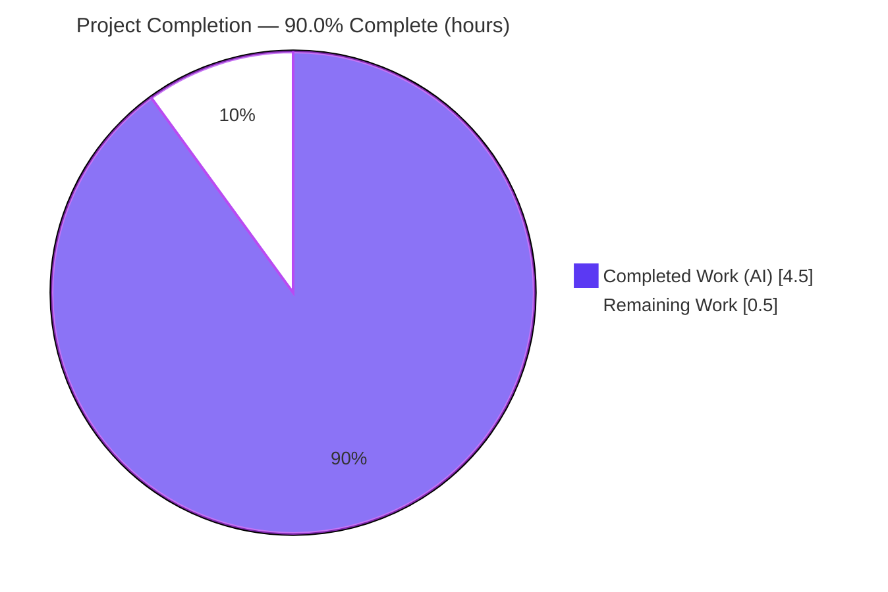
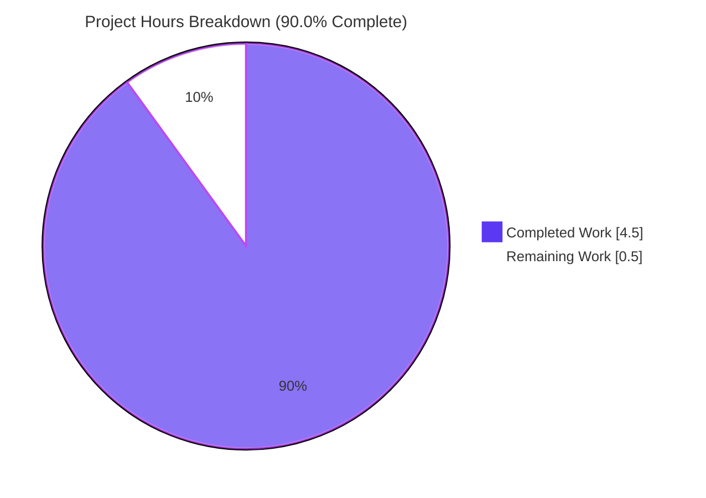

# Blitzy Project Guide — Artifact5

> Node.js + Express Tutorial Server · Branch `blitzy-7e5e949d-35cd-4d29-8388-3e09d05adeb8` · HEAD `ac3d1b8`
>
> **Legend / Brand Colors** — <span style="color:#5B39F3">**Completed / AI Work = Dark Blue (#5B39F3)**</span> · Remaining / Not Completed = White (#FFFFFF) · Headings/Accents = Violet-Black (#B23AF2) · Highlights = Mint (#A8FDD9)

---

## 1. Executive Summary

### 1.1 Project Overview
Artifact5 is a minimal Node.js tutorial web server. The objective was to introduce the **Express.js** framework into the project and expose a second HTTP endpoint, `GET /good-evening`, that returns the exact string **"Good evening"**, served alongside the tutorial's baseline `GET /` endpoint returning **"Hello world"**. Because the repository was a greenfield scaffold (only a `README.md` containing `# Artifact5`), the entire Node.js + Express application was bootstrapped from scratch — manifest, server entry point, dependency tree, ignore rules, and documentation. The target users are developers learning a minimal Express routing pattern; the technical scope is a single-process, two-route, plain-text HTTP server with a configurable port.

### 1.2 Completion Status



| Metric | Value |
|--------|-------|
| **Total Hours** | **5.0** |
| **Completed Hours (AI + Manual)** | **4.5** (4.5 AI · 0.0 Manual) |
| **Remaining Hours** | **0.5** |
| **Percent Complete** | **90.0%** |

> Completion is computed using AAP-scoped hours only: `4.5 ÷ (4.5 + 0.5) × 100 = 90.0%`. Every AAP deliverable and behavioral requirement is delivered, committed, and validated; the residual 0.5h is the mandatory human review/merge gate (a project is never reported as 100% complete prior to human acceptance).

### 1.3 Key Accomplishments
- ✅ **Express.js introduced** as the project's first declared framework (`express ^5.2.1`), confirmed in use at runtime (`X-Powered-By: Express`).
- ✅ **Baseline endpoint** `GET /` returns exactly **"Hello world"** (HTTP 200, 11 bytes).
- ✅ **New requested endpoint** `GET /good-evening` returns exactly **"Good evening"** (HTTP 200, 12 bytes).
- ✅ **Node project bootstrapped** from greenfield — `package.json`, `server.js`, `.gitignore`, committed `package-lock.json`, and documented `README.md`.
- ✅ **Configurable port** — default `3000` with `process.env.PORT` override (verified on `PORT=4010`).
- ✅ **Routing isolation** — unknown paths fall through to Express's default `404`.
- ✅ **Reproducible, clean install** — `npm ci` resolves 66 packages with **0 vulnerabilities**; lockfile committed.
- ✅ **Clean git tree** — only the intended files are tracked; no out-of-scope changes.

### 1.4 Critical Unresolved Issues

| Issue | Impact | Owner | ETA |
|-------|--------|-------|-----|
| _None_ | All five autonomous validation gates passed with zero defects; no blocking issues identified. | — | — |

### 1.5 Access Issues

| System/Resource | Type of Access | Issue Description | Resolution Status | Owner |
|-----------------|----------------|-------------------|-------------------|-------|
| _N/A_ | — | No access issues identified. The build is fully self-contained: dependencies install from the public npm registry, no credentials/API keys/external services are required, and validation ran end-to-end locally. | Resolved (none) | — |

### 1.6 Recommended Next Steps
1. **[High]** Review the pull request (5 files, 53 hand-authored lines) and run the AAP §0.6 verification locally (`npm ci` → `npm start` → the three `curl` probes), then **approve and merge to main**. *(This is the sole in-scope remaining task — 0.5h.)*
2. **[Low]** *(Optional, out of AAP scope)* Set `res.type('text/plain')` on responses to remove the benign browser "Quirks Mode" console note (AAP §0.3.3 deems the current `text/html` default acceptable).
3. **[Low]** *(Optional, out of AAP scope)* Add an automated test suite (e.g., Jest + supertest) to make the `curl` probes CI-runnable.
4. **[Low]** *(Optional, out of AAP scope)* Production hardening if this graduates beyond a tutorial — `helmet`/`app.disable('x-powered-by')`, a `/health` endpoint, request logging, and a `Dockerfile`/process manager.

---

## 2. Project Hours Breakdown

### 2.1 Completed Work Detail
<span style="color:#5B39F3">**Completed (AI) = 4.5 hours.**</span> Every component traces to a specific AAP requirement.

| Component | Hours | Description |
|-----------|------:|-------------|
| Node.js project manifest — `package.json` | 0.5 | [AAP §0.4.1] Declares `express ^5.2.1`, `scripts.start = "node server.js"`, `main = server.js`, `engines.node >= 18`, MIT license. Commit 998a609. |
| Express server implementation — `server.js` | 1.5 | [AAP §0.4.1] CommonJS entry point: `GET /` → "Hello world"; `GET /good-evening` → "Good evening"; `app.listen(process.env.PORT \|\| 3000)` with startup log; inline documentation. Commit ac3d1b8. |
| Dependency installation & lockfile | 0.5 | [AAP §0.4.2] `npm install` resolving Express 5.2.1 + 65 transitive deps; `package-lock.json` (lockfileVersion 3) committed for reproducibility. Commit 65c12a4. |
| Repository hygiene — `.gitignore` | 0.25 | [AAP §0.4.1] Ignores `node_modules/`, `npm-debug.log*`, `.env`. Commit 998a609. |
| Documentation — `README.md` | 0.5 | [AAP §0.4.2] Preserves `# Artifact5` heading; appends Run steps + Endpoints table. Commit 7596bb7. |
| Autonomous validation & verification (5 gates) | 1.25 | [Path-to-production] Dependency audit (`npm ci`, 0 vuln); static checks (`node --check`, `require.resolve`); runtime byte-for-byte `curl` probes; `/missing` 404; `PORT` override; Chrome DevTools browser verification (6 screenshots); clean-tree confirmation. |
| **TOTAL** | **4.5** | Matches Completed Hours in Section 1.2. |

### 2.2 Remaining Work Detail
**Remaining = 0.5 hours.** Each item traces to a path-to-production need; AAP §0.5.2-excluded items are deliberately omitted (see note below).

| Category | Hours | Priority |
|----------|------:|----------|
| Human code review, PR acceptance & merge (review 5 files / 53 lines, run AAP §0.6 verification, approve & merge to main) | 0.5 | High |
| **TOTAL** | **0.5** | Matches Remaining Hours in Section 1.2 and Section 7 pie chart. |

> **Out-of-scope optional enhancements (0 hours — NOT counted in project totals).** Per AAP §0.5.2/§0.3.3 the following are explicitly excluded and therefore excluded from the completion math: automated test suite/CI, `res.type('text/plain')` refinement, TypeScript/linter/formatter, database/auth/logging middleware, `helmet`/header hardening, `/health` endpoint, and containerization/deployment manifests. They are listed only for the team's future awareness (Section 1.6).

### 2.3 Hours Reconciliation & Methodology
- **Formula:** `Completion % = Completed ÷ (Completed + Remaining) × 100 = 4.5 ÷ 5.0 × 100 = 90.0%`.
- **Integrity check:** Section 2.1 total (4.5h) **+** Section 2.2 total (0.5h) **=** Total Project Hours (5.0h) ✔
- **Cross-section:** Remaining hours are identical in Section 1.2 (0.5h), Section 2.2 (0.5h), and the Section 7 pie chart "Remaining Work" (0.5h) ✔
- **Confidence:** High. The scope is small, fully enumerated by the AAP, and 100% validated; the only uncertainty is the duration of human review, estimated conservatively at 0.5h.

---

## 3. Test Results
All checks below originate from Blitzy's autonomous validation logs for this project. Per AAP §0.5.2, **no automated test framework is in scope**; functional correctness is verified via runtime probes (AAP §0.6), which the autonomous validator executed.

| Test Category | Framework | Total Tests | Passed | Failed | Coverage % | Notes |
|---------------|-----------|------------:|-------:|-------:|-----------:|-------|
| Runtime Functional Probes | `curl` (AAP §0.6) | 3 | 3 | 0 | N/A | `/` → "Hello world" (11B, 200); `/good-evening` → "Good evening" (12B, 200); `/missing` → 404 (routing isolation). |
| Dependency Audit | `npm ci` / `npm audit` | 1 | 1 | 0 | N/A | 66 packages, **0 vulnerabilities**, lockfile unchanged. |
| Static / Syntax Check | `node --check` | 1 | 1 | 0 | N/A | `server.js` syntax valid; `require('express')` resolves. |
| Automated Unit / Integration | None (excluded by AAP §0.5.2) | 0 | 0 | 0 | N/A | Out of scope by design; verification via probes. |
| **TOTAL** | — | **5** | **5** | **0** | **N/A** | **100% pass rate.** |

---

## 4. Runtime Validation & UI Verification

**Runtime health & API integration** — re-verified end-to-end against the live repository:
- ✅ **Operational** — `npm start` / `node server.js` logs `Server listening on http://localhost:3000`.
- ✅ **Operational** — `GET /` → "Hello world" (HTTP 200, exactly 11 bytes).
- ✅ **Operational** — `GET /good-evening` → "Good evening" (HTTP 200, exactly 12 bytes).
- ✅ **Operational** — `GET /missing` → HTTP 404 (Express default handler; routing isolation confirmed).
- ✅ **Operational** — `PORT` override honored (`PORT=4010` → `Server listening on http://localhost:4010`).
- ✅ **Operational** — Express confirmed genuinely in use (`X-Powered-By: Express` response header).
- ✅ **Operational** — Latency sub-millisecond (~0.7ms locally); clean start/stop with no stray processes.

**UI / Browser verification** — this is a backend plain-text server with **no graphical UI**; browser rendering was still validated via Chrome DevTools:
- ✅ **Operational** — Browser renders the `/` and `/good-evening` responses as plain text (6 screenshots saved under `blitzy/screenshots/`: `runtime_root_hello_world_3000.png`, `runtime_good_evening_3000.png`, `endpoint_*`, `F1_*`, `F2_*`).
- ⚠ **Partial (cosmetic, non-blocking)** — Because `res.send('<string>')` returns `Content-Type: text/html; charset=utf-8` with no DOCTYPE, the browser emits a benign **"Quirks Mode"** console note. Per AAP §0.3.3 this is **explicitly acceptable** (text/plain is an optional refinement, not a requirement) and was intentionally left unchanged to avoid out-of-scope gold-plating.

---

## 5. Compliance & Quality Review
AAP deliverables cross-mapped to Blitzy quality and compliance benchmarks. **No fixes were required during autonomous validation — zero defects were found.**

| Benchmark / AAP Requirement | Status | Progress | Notes |
|------------------------------|--------|----------|-------|
| Express introduced as a runtime dependency | ✅ Pass | 100% | `express ^5.2.1` declared & installed. |
| `GET /` returns "Hello world" verbatim | ✅ Pass | 100% | Byte-for-byte (11 bytes). |
| `GET /good-evening` returns "Good evening" verbatim | ✅ Pass | 100% | Byte-for-byte (12 bytes). |
| Configurable port (default 3000 + `PORT` override) | ✅ Pass | 100% | Verified `PORT=4010`. |
| CommonJS module system (AAP §0.2) | ✅ Pass | 100% | `require('express')`. |
| Reproducible install (lockfile committed) | ✅ Pass | 100% | `npm ci` clean, lockfileVersion 3. |
| Zero dependency vulnerabilities | ✅ Pass | 100% | `npm audit` → 0. |
| README `# Artifact5` heading preserved | ✅ Pass | 100% | Diff confirms heading intact; content appended only. |
| `node_modules/` ignored, not committed | ✅ Pass | 100% | `.gitignore` enforces. |
| Zero out-of-scope changes (AAP §0.5.2) | ✅ Pass | 100% | Only enumerated files changed. |
| Clean working tree | ✅ Pass | 100% | Only `blitzy/` scratch dir untracked. |
| Code quality — no placeholders/stubs/TODOs | ✅ Pass | 100% | Full implementation with inline docs. |
| Fixes applied during validation | ✅ None needed | — | 0 defects; Issue Resolution Workflow not triggered. |

---

## 6. Risk Assessment
All identified risks are **Low** (or N/A) severity — appropriate for a minimal, fully-validated tutorial server. Each is either Mitigated or explicitly Accepted within AAP scope.

| Risk | Category | Severity | Probability | Mitigation | Status |
|------|----------|----------|-------------|------------|--------|
| No automated test suite — regressions not auto-caught | Technical | Low | Low | AAP-mandated `curl` probes; add suite if project grows | Accepted (AAP §0.5.2) |
| `Content-Type: text/html` triggers browser "Quirks Mode" note | Technical | Low | Cosmetic | Optional `res.type('text/plain')` | Accepted (AAP §0.3.3) |
| No authentication/authorization on endpoints | Security | Low | Low | Static public greetings; no sensitive data | Accepted (tutorial scope) |
| Transitive dependency CVEs emerging over time | Security | Low | Low | 0 vulnerabilities now; periodic `npm audit`/Dependabot | Mitigated |
| `X-Powered-By: Express` header info disclosure | Security | Low | Low | `app.disable('x-powered-by')` / `helmet` | Accepted (out of scope) |
| No process manager / no auto-restart on crash | Operational | Low | Low | pm2/systemd/container in real deployment | Accepted (out of scope) |
| Minimal logging (startup line only) | Operational | Low | Low | morgan/pino if productionized | Accepted (out of scope) |
| No health-check endpoint | Operational | Low | Low | Add `/health` if behind a load balancer | Accepted (out of scope) |
| Port 3000 conflict on host | Integration | Low | Low | `PORT` env override implemented & verified | Mitigated |
| External integrations (DB/3rd-party/credentials) | Integration | N/A | N/A | None exist — zero integration surface | N/A |
| Node engine compatibility | Integration | Low | Low | `engines.node >= 18` declared; verified on Node v20.20.2 | Mitigated |

---

## 7. Visual Project Status

**Hours — Completed vs. Remaining** (Completed = Dark Blue #5B39F3, Remaining = White #FFFFFF):



**Remaining hours by category** (from Section 2.2):

| Category | Hours | Priority |
|----------|------:|----------|
| Human code review, PR acceptance & merge | 0.5 | High |
| **Total Remaining** | **0.5** | — |

> Integrity: the "Remaining Work" slice (0.5h) equals Section 1.2 Remaining Hours (0.5h) and the Section 2.2 Hours total (0.5h). The "Completed Work" slice (4.5h) equals Section 1.2 Completed Hours and the Section 2.1 total.

---

## 8. Summary & Recommendations

**Achievements.** The greenfield Artifact5 repository was bootstrapped into a working Node.js + Express tutorial server that fulfills the feature request precisely: Express.js is introduced as the project's first framework, the baseline `GET /` → "Hello world" endpoint is (re)established, and the newly requested `GET /good-evening` → "Good evening" endpoint is added. All six AAP §0.5.1 artifacts are present, committed, and match the specification byte-for-byte.

**Remaining gaps.** None within the autonomous scope. The only outstanding item is the **human review/merge gate** (0.5h). All AAP §0.5.2-excluded items (tests/CI, linter, Docker, deploy, extra middleware) are intentionally absent and are **not** counted as gaps.

**Critical path to production.** `Review PR → run AAP §0.6 verification (npm ci → npm start → curl probes) → approve → merge`. There is no build/transpile step, no external dependency to provision, and no credentials to configure.

**Success metrics (all met).** 5/5 verification checks pass; 0 vulnerabilities; both endpoints return exact strings; unknown paths 404; reproducible install; clean git tree.

**Production-readiness assessment.** The project is **90.0% complete** and **production-ready for its stated tutorial scope**. It is recommended for merge after the standard human code review. If the server is later promoted beyond a tutorial, adopt the optional hardening/observability/deployment enhancements listed in Sections 1.6 and 2.2 (each currently out of AAP scope).

| Metric | Value |
|--------|-------|
| Completion | 90.0% |
| Completed / Total Hours | 4.5 / 5.0 |
| Remaining Hours | 0.5 |
| Validation gates passed | 5 / 5 |
| Verification checks passed | 5 / 5 |
| Open defects | 0 |
| Dependency vulnerabilities | 0 |

---

## 9. Development Guide
Every command below was executed live against this repository and produced the stated output.

### 9.1 System Prerequisites
- **Node.js ≥ 18** (declared via `engines.node`). Validated on **v20.20.2**.
- **npm** (ships with Node). Validated on **11.1.0**.
- OS: any Linux/macOS/Windows shell. No database, cache, message queue, or external service required.

```bash
node --version   # expect v18+ (validated v20.20.2)
npm --version    # validated 11.1.0
```

### 9.2 Environment Setup
- No environment variables are required. The only optional variable is `PORT` (defaults to `3000`).
- No `.env` file is needed; if you create one, it is git-ignored.

```bash
# optional: run on a custom port
export PORT=4010
```

### 9.3 Dependency Installation
From the repository root:

```bash
npm ci          # reproducible install from package-lock.json (preferred)
# or: npm install
```
Expected output (abridged):
```
added 66 packages, and audited 67 packages in ~0.5s
found 0 vulnerabilities
```
Verify the dependency tree:
```bash
npm ls --depth=0
# artifact5@1.0.0
# └── express@5.2.1
```

### 9.4 Application Startup
```bash
npm start          # equivalent to: node server.js
```
Expected console output:
```
Server listening on http://localhost:3000
```
Run on a custom port:
```bash
PORT=4010 npm start   # → Server listening on http://localhost:4010
```

### 9.5 Verification Steps
In a second shell while the server runs:
```bash
curl -s http://localhost:3000/                                            # → Hello world
curl -s http://localhost:3000/good-evening                                # → Good evening
curl -s -o /dev/null -w "%{http_code}\n" http://localhost:3000/missing    # → 404
curl -sI http://localhost:3000/ | grep -i x-powered-by                    # → X-Powered-By: Express
```
Optional static checks (no server needed):
```bash
node --check server.js                                  # syntax OK (exit 0)
node -e "console.log(require.resolve('express'))"       # resolves express path
```

### 9.6 Example Usage (end-to-end)
```bash
npm ci && npm start &          # install + launch in background
sleep 1
curl -s http://localhost:3000/               # Hello world
curl -s http://localhost:3000/good-evening   # Good evening
kill %1                                       # stop the background server
```

### 9.7 Troubleshooting
| Symptom | Cause | Resolution |
|---------|-------|------------|
| `Error: listen EADDRINUSE :::3000` | Port 3000 already in use | Run `PORT=<n> npm start`, or free the port: `lsof -i :3000` then stop the owning process |
| `Error: Cannot find module 'express'` (`MODULE_NOT_FOUND`) | Dependencies not installed | Run `npm ci` (or `npm install`) from the repo root |
| Server exits immediately / SyntaxError | Node version too old | Install Node ≥ 18 (`engines.node >= 18`) |
| Browser console shows "Quirks Mode" | `res.send` returns `text/html` (no DOCTYPE) | Benign per AAP §0.3.3; optionally add `res.type('text/plain')` |
| `curl` connection refused | Server not running / wrong port | Confirm the startup log and that you target the correct port |

---

## 10. Appendices

### Appendix A — Command Reference
| Command | Purpose |
|---------|---------|
| `npm ci` | Reproducible install from `package-lock.json` |
| `npm install` | Install dependencies (updates lockfile if needed) |
| `npm start` | Launch the server (`node server.js`) |
| `npm ls --depth=0` | Show top-level dependency tree |
| `node --check server.js` | Static syntax validation |
| `curl -s http://localhost:3000/` | Probe the baseline endpoint |
| `curl -s http://localhost:3000/good-evening` | Probe the new endpoint |
| `curl -s -o /dev/null -w "%{http_code}" .../missing` | Confirm 404 routing isolation |

### Appendix B — Port Reference
| Port | Service | Notes |
|------|---------|-------|
| 3000 | Express HTTP server (default) | Override via `PORT` env var |
| 4010 | Example custom port | Used during `PORT` override validation |

### Appendix C — Key File Locations
| Path | Role |
|------|------|
| `server.js` | Express entry point — routes `/` and `/good-evening`, listener |
| `package.json` | Manifest — Express dependency, `start` script, engines, license |
| `package-lock.json` | Committed lockfile (lockfileVersion 3) for reproducible installs |
| `.gitignore` | Ignores `node_modules/`, `npm-debug.log*`, `.env` |
| `README.md` | Project docs — `# Artifact5` heading + Run + Endpoints |
| `node_modules/` | Installed dependencies (generated, git-ignored) |
| `blitzy/screenshots/` | Validator browser-verification screenshots (untracked scratch) |

### Appendix D — Technology Versions
| Technology | Version | Notes |
|------------|---------|-------|
| Node.js | ≥ 18 required; validated v20.20.2 | `engines.node >= 18` |
| npm | 11.1.0 | Lockfile v3 |
| Express | ^5.2.1 (resolved 5.2.1) | Project's first declared framework |
| Module system | CommonJS | `require()` (AAP §0.2) |
| Total npm packages | 66 (express + 65 transitive) | 0 vulnerabilities |

### Appendix E — Environment Variable Reference
| Variable | Required | Default | Purpose |
|----------|----------|---------|---------|
| `PORT` | No | `3000` | TCP port the server binds to |

### Appendix F — Developer Tools Guide
- **Chrome DevTools** (used during autonomous validation): browser-rendered both endpoints; 6 screenshots saved under `blitzy/screenshots/`. Note these are scratch artifacts and are intentionally untracked.
- **curl**: primary functional verification tool (AAP §0.6 probes).
- **node --check**: zero-dependency static syntax verification.
- **npm audit / npm ci**: dependency integrity and reproducibility.

### Appendix G — Glossary
| Term | Definition |
|------|------------|
| AAP | Agent Action Plan — the authoritative scope document for this work |
| Greenfield | A project starting from an empty/near-empty state (here, only `README.md`) |
| CommonJS | Node's `require()`-based module system (vs. ESM `import`) |
| Routing isolation | Confirmation that defined routes don't capture unrelated paths (unknown → 404) |
| Lockfile | `package-lock.json` pinning exact dependency versions for reproducible installs |
| Path-to-production | Standard activities (build/verify/review/deploy) required to ship AAP deliverables |
| Quirks Mode | Legacy browser rendering mode triggered by HTML lacking a DOCTYPE — benign here |
